# DeepSeek-V4 的百万上下文注意力设计：CSA 与 HCA

> 本文围绕 DeepSeek-V4 的百万 token 上下文注意力设计展开，重点分析长上下文推理中的 KV cache 与 attention 计算瓶颈，以及 CSA/HCA 在 Hybrid Attention 架构中的分工。

## 1. DeepSeek-V4 概览

DeepSeek-V4 是一个面向百万 token 上下文的 MoE 模型系列，官方发布形态可按两个维度理解：一是 Flash / Pro 两个规模，二是 Base / post-trained 两类训练阶段。所有版本都支持 1M token context，并共享同一套开源 inference 实现；规模差异主要体现在 `hidden_size`、层数、attention heads 数量、专家规模、`index_topk` 和 `compress_ratios` 层间配置上。

| 模型 | 总参数 | 激活参数 | Context length | 精度 | 定位 |
| --- | ---: | ---: | ---: | --- | --- |
| DeepSeek-V4-Flash-Base | 284B | 13B | 1M | FP8 Mixed | Flash 规模的 base model，用于基础能力评测和后续训练 |
| DeepSeek-V4-Flash | 284B | 13B | 1M | FP4 + FP8 Mixed | Flash 规模的对话 / 推理模型，强调低成本长上下文使用 |
| DeepSeek-V4-Pro-Base | 1.6T | 49B | 1M | FP8 Mixed | Pro 规模的 base model，用于基础能力评测和后续训练 |
| DeepSeek-V4-Pro | 1.6T | 49B | 1M | FP4 + FP8 Mixed | Pro 规模的对话 / 推理模型，面向更高能力上限 |

其中 Base 表示基础模型版本，主要用于预训练后能力评测和进一步对齐训练；不带 Base 的 Flash / Pro 则是经过后训练的模型版本，支持 non-thinking、thinking 和 Think Max 等推理模式。

从发布时间看，DeepSeek-V4 属于 DeepSeek-V3 之后的一次大版本架构更新。Hugging Face 官方博客在 2026-04-24 发布 DeepSeek-V4 介绍；作为对照，Hugging Face Transformers 文档记录 DeepSeek-V3 发布于 2024-12-27。按公开发布口径计算，二者间隔约 483 天，即约 16 个月。

相比 DeepSeek-V3，DeepSeek-V4 本次更新的重点更集中在百万上下文推理效率、长轨迹 agent 任务和 KV cache 成本控制上。

从官方模型页面给出的评测看，V4-Pro 在知识、长上下文和 agentic 任务上明显强于 V3.2-Base；在与闭源前沿模型比较时，V4-Pro-Max 并非所有项目第一，但在代码、长上下文和部分 agentic benchmark 上具备接近前沿模型的表现。

| 评测项 | DeepSeek-V3.2-Base | DeepSeek-V4-Flash-Base | DeepSeek-V4-Pro-Base | 观察 |
| --- | ---: | ---: | ---: | --- |
| MMLU-Pro, EM | 65.5 | 68.3 | 73.5 | Pro-Base 相比 V3.2-Base 有明显提升 |
| SimpleQA Verified, EM | 28.3 | 30.1 | 55.2 | Pro-Base 在事实问答上提升最显著 |
| FACTS Parametric, EM | 27.1 | 33.9 | 62.6 | 长期知识记忆与参数化事实能力增强 |
| HumanEval, Pass@1 | 62.8 | 69.5 | 76.8 | 代码生成能力提升 |
| LongBench-V2, EM | 40.2 | 44.7 | 51.5 | 长上下文 benchmark 提升 |

| 评测项 | Claude Opus 4.6 Max | GPT-5.4 xHigh | Gemini 3.1 Pro High | DS-V4-Pro Max | 观察 |
| --- | ---: | ---: | ---: | ---: | --- |
| MMLU-Pro, EM | 89.1 | 87.5 | 91.0 | 87.5 | 接近 GPT-5.4，但低于 Gemini 3.1 Pro |
| GPQA Diamond, Pass@1 | 91.3 | 93.0 | 94.3 | 90.1 | 高难推理仍略低于主要闭源模型 |
| LiveCodeBench, Pass@1 | 88.8 | - | 91.7 | 93.5 | 代码 benchmark 上表现突出 |
| MRCR 1M, MMR | 92.9 | - | 76.3 | 83.5 | 1M 长上下文能力高于 Gemini 3.1 Pro，但低于 Opus 4.6 |
| SWE Verified, Resolved | 80.8 | - | 80.6 | 80.6 | 软件工程任务接近闭源前沿 |
| Terminal Bench 2.0, Acc | 65.4 | 75.1 | 68.5 | 67.9 | agentic terminal 任务处于第二梯队 |

DeepSeek-V4 依然主打性价比。DeepSeek 官方 API 文档显示，V4-Flash 和 V4-Pro 均按 1M tokens 计价，Pro 价格在 2026-05-31 15:59 UTC 后正式调整为原价的 1/4。按输出价格比较，DeepSeek-V4-Pro 为 $0.87 / 1M tokens，约为 GPT-5.4 的 5.8%、Claude Opus 4.6 的 3.5%、Gemini 3.1 Pro Preview 的 4.8%-7.3%。

| 模型 | 上下文长度 | 输入，cache miss | 输入，cache hit / cached | 输出 | 备注 |
| --- | ---: | ---: | ---: | ---: | --- |
| DeepSeek-V4-Flash | 1M | $0.14 / 1M tokens | $0.0028 / 1M tokens | $0.28 / 1M tokens | DeepSeek 官方 API |
| DeepSeek-V4-Pro | 1M | $0.435 / 1M tokens | $0.003625 / 1M tokens | $0.87 / 1M tokens | DeepSeek 官方 API，1/4 价格口径 |
| GPT-5.4 | 270K 以下标准价 | $2.50 / 1M tokens | $0.25 / 1M tokens | $15.00 / 1M tokens | OpenAI 官方 API |
| Claude Opus 4.6 | 1M | $5.00 / 1M tokens | $0.50 / 1M tokens | $25.00 / 1M tokens | Anthropic 官方 API，标准模式 |
| Gemini 3.1 Pro Preview | <=200K | $2.00 / 1M tokens | $0.20 / 1M tokens | $12.00 / 1M tokens | Google Gemini API 标准价 |
| Gemini 3.1 Pro Preview | >200K | $4.00 / 1M tokens | $0.40 / 1M tokens | $18.00 / 1M tokens | Google Gemini API 标准价 |

上述评测与价格定位背后，是 DeepSeek-V4 对长上下文能力、训练稳定性和推理成本的一组系统设计：

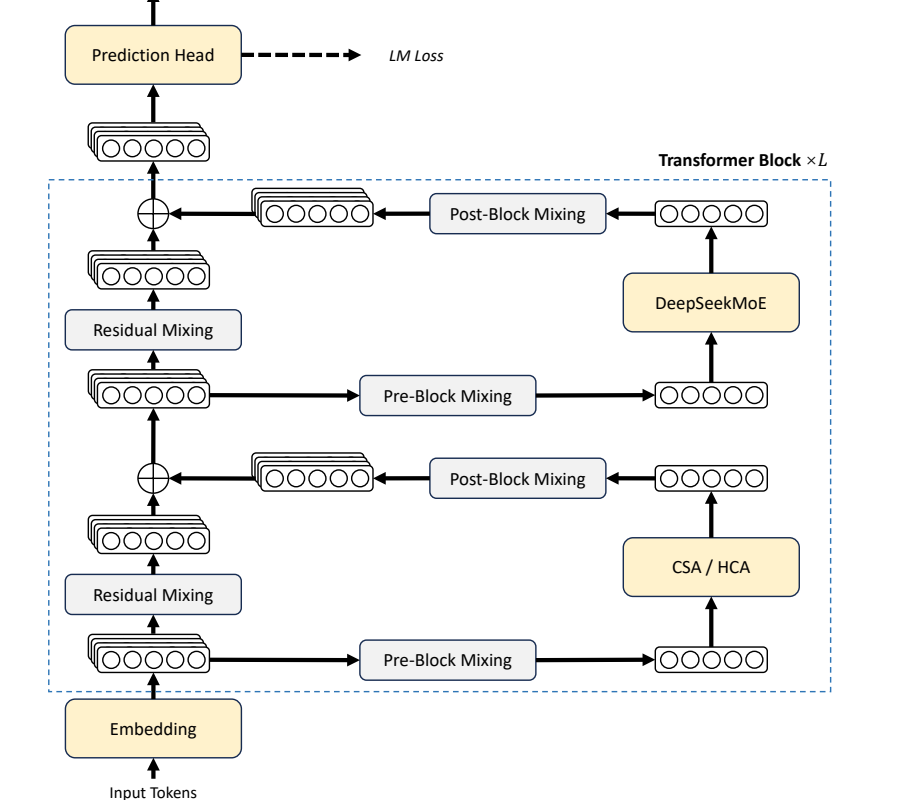

这张结构图说明了 DeepSeek-V4 中几类关键模块的位置关系。虚线框表示重复堆叠的 Transformer block：右下方的 CSA/HCA 位于 attention 路径，负责 token 间信息交互；右上方的 DeepSeekMoE 位于前馈网络路径，用于提升参数容量和计算效率；左侧的 Residual Mixing 以及中间的 Pre-Block / Post-Block Mixing 对应 mHC 相关连接，用于改善层间信息传递。输入 token 经过 embedding 后进入多层 block，最终由 prediction head 输出下一 token 分布。

| 工作 | 简要说明 | 主要优化对象 |
| --- | --- | --- |
| **Hybrid Attention, CSA/HCA** | **在 attention 路径中混合 Compressed Sparse Attention 和 Heavily Compressed Attention，降低长上下文 attention 计算与 KV cache 成本。** | **Sequence / block 维度的历史 KV 访问与缓存** |
| DeepSeekMoE | 在前馈网络中使用 MoE 结构，通过稀疏激活提升模型容量与计算效率。 | FFN 参数容量与每 token 激活计算量 |
| Manifold-Constrained Hyper-Connections, mHC | 增强 residual / block mixing 连接，改善深层网络的信息流动。 | 层间表示传递与训练稳定性 |
| Muon Optimizer | 用于提升大规模训练过程中的收敛效率与稳定性。 | 优化器与训练动态 |
| 低精度与推理实现 | 结合 FP8、FP4、sparse attention kernel 和缓存管理降低服务成本。 | 推理显存、带宽、吞吐与延迟 |

本文重点分析第一项，即 **Hybrid Attention 中的 CSA 与 HCA**。HCA 指 Heavily Compressed Attention，属于注意力机制；mHC 指 Manifold-Constrained Hyper-Connections，属于连接结构增强机制。二者名称相近，但作用位置和优化对象不同。

长文档问答、代码仓库级理解、长链路 agent 工作流、多轮工具调用以及 test-time scaling，都要求模型在很长的历史上下文中保存、检索和整合相关信息。因此，在讨论具体优化机制之前，需要先明确 1M context 下 KV cache 与 attention 计算的主要瓶颈。

## 2. 长上下文的核心瓶颈：KV cache 与 attention 计算

自回归模型在 decode 阶段每生成一个新 token，都需要使用当前 query 访问历史 token 的 key 和 value。随着历史长度增加，KV cache 的容量需求和访问带宽同步增长。在短上下文场景下，KV cache 读写和 attention 计算在总推理成本中的占比相对有限；当上下文扩展到 1M token 时，这两部分会成为推理效率的主要约束。

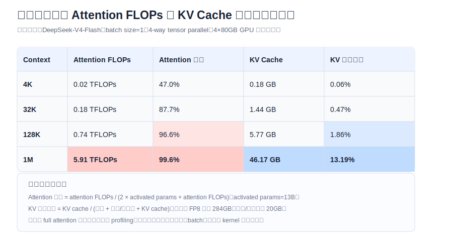

更具体地看，decode 阶段的 attention 成本可以用 FLOPs 和 KV cache 存储量衡量。下表选取一个明确的推理口径作估算：DeepSeek-V4-Flash，batch size = 1，4-way tensor parallel，4 张 80GB GPU 汇总显存；配置取 `num_hidden_layers=43`、`num_attention_heads=64`、`head_dim=512`、`num_key_value_heads=1`，KV cache 按 FP8 计算。Attention FLOPs 统计单个 output token 在所有层中执行 score 计算和 value 加权求和的量级；Attention 占比使用 `attention FLOPs / (2 × activated params + attention FLOPs)` 估算，其中 Flash 激活参数为 13B。KV cache 占比的分母为 `权重 + 激活/工作区 + KV cache`，其中权重按 FP8 等效 284GB，激活/工作区按 20GB 估算。

| Context length | Attention FLOPs / output token | Attention FLOPs 占比 | KV cache 存储量 | KV cache 显存占比 |
| ---: | ---: | ---: | ---: | ---: |
| 4K | 0.02 TFLOPs | 47.0% | 0.18 GB | 0.06% |
| 32K | 0.18 TFLOPs | 87.7% | 1.44 GB | 0.47% |
| 128K | 0.74 TFLOPs | 96.6% | 5.77 GB | 1.86% |
| 1M | 5.91 TFLOPs | 99.6% | 46.17 GB | 13.19% |

这些数值不是 profiling 结果，而是用统一公式得到的量级估算；实际值会随 batch size、并行方式、KV 精度、attention kernel 和缓存布局变化。但趋势是明确的：上下文从 4K 扩展到 1M 后，attention FLOPs 从约 0.02 TFLOPs 增至约 5.91 TFLOPs，单请求 KV cache 从约 0.18GB 增至约 46.17GB。公开系统文章也指出，长上下文服务在 128K 以上容易进入 memory-bound 状态，decode 阶段需要读取大量 KV cache。

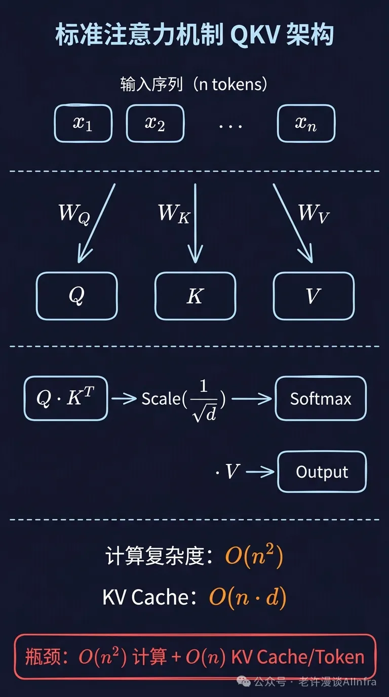

以普通 MHA 的 KV cache 为例，一层 attention 中 key 和 value 的典型 shape 可表示为：

```text
K, V: [batch, seq_len, num_heads, head_dim]
```

其中 `seq_len` 表示历史上下文长度，`num_heads` 表示 KV head 数量，`head_dim` 表示每个 head 的维度。当 `seq_len` 增加时，KV cache 容量线性增加；若每个 head 均保存独立 K/V，`num_heads` 也会进一步放大缓存成本。在 1M context 场景下，即使单个 token 的 KV 表示较小，叠加层数、head 数量和存储精度后，仍会形成显著的内存容量和访问带宽压力。

Q/K/V 三类投影对应不同语义角色：`Q` 表示当前 token 的信息需求，`K` 表示历史 token 可被匹配的索引特征，`V` 表示匹配后被读取的内容载荷。投影本身对序列长度通常是线性成本；长上下文瓶颈主要来自后续的 `QK^T` 匹配矩阵和基于 attention score 的加权求和。

decode 阶段的单 token attention 计算也随历史长度增长。当前 token 的 attention score 可表示为：

```text
score_t = q_t · K_{1:t}^T
```

`q_t` 表示当前 token 的 query，`K_{1:t}` 表示从第 1 个历史 token 到当前位置之前的所有 key。该式说明，生成第 `t` 个 token 时，query 需要与历史 key 逐一计算匹配分数；历史长度越长，点积计算数量越多。因此，单步 decode 的 attention score 计算量大致随历史 token 数线性增长。

因此，长上下文 attention 至少包含两个相关但不同的瓶颈：

| 瓶颈 | 主要问题 | 影响 |
| --- | --- | --- |
| KV cache 内存和带宽 | 历史 K/V 的存储量和读取量随序列长度增长 | 上下文越长，缓存容量和带宽压力越高 |
| Attention FLOPs | query 需要与大量历史 key 计算匹配分数 | 每生成一个 token，都需要处理更长的历史序列 |

多种 attention 优化方法均围绕同一目标展开：在尽量保留有效信息的前提下，降低 KV 存储、KV 读取和 attention 计算成本。从 tensor 维度看，压缩可发生在多个方向：减少 KV head 数量，将 KV 表示压缩到 latent space，减少参与 attention 的历史位置，或沿 sequence/block 维度将多个 token 的 KV 合并为 compressed KV entry。

## 3. Attention 压缩路线：从 MHA、MLA 到 DSA

在分析 CSA/HCA 之前，有必要先比较几类常见 attention 压缩路线。它们分别作用于 KV head 维度、hidden/latent 表示维度以及 sequence/block 访问维度，由此构成理解 DeepSeek-V4 Hybrid Attention 的技术背景。

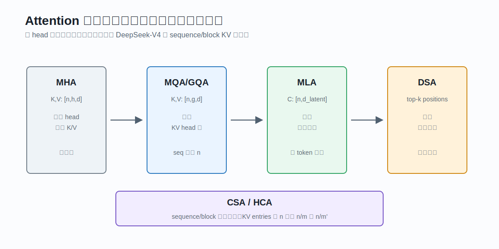

### MHA：表达直接，但 KV 成本高

Naive MHA 中，每个 attention head 都拥有独立的 query、key 和 value 投影。设输入 hidden states 为：

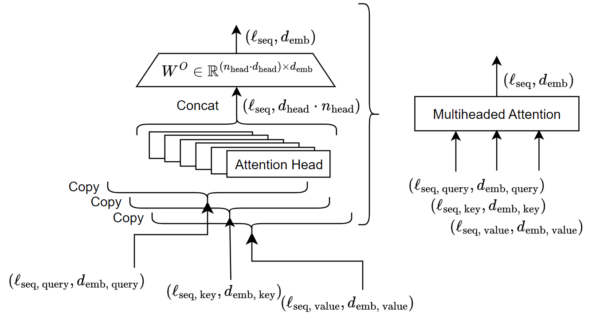

```text
H: [n, d]
```

其中 `n` 是序列长度，`d` 是 hidden size。MHA 投影出多组 K/V：

```text
K, V: [n, h, d_head]
```

`h` 表示 head 数量。该结构的优势在于各个 head 可以学习不同的匹配模式；其代价是 KV cache 规模与 `n`、`h` 和 `d_head` 同时相关。在长上下文 decode 场景中，缓存容量和读取带宽都会随序列长度显著增加。

MQA/GQA 通过让多个 query head 共享部分或全部 KV head 来降低 KV cache 成本。以 MQA 为例，其 KV 表示可简化为：

```text
Q: [n, h_q, d_head]
K, V: [n, 1, d_head]
```

该方法主要压缩 KV head 维度，能够降低 cache 成本，但不改变历史位置数量。换言之，sequence 维度仍保持为 `n`，query 仍需处理完整历史序列。

### MLA：压缩表示维度

MLA 的核心思路是将 KV 相关表示压缩到 latent representation，并在 attention 计算中使用或恢复该表示。简化表示如下：

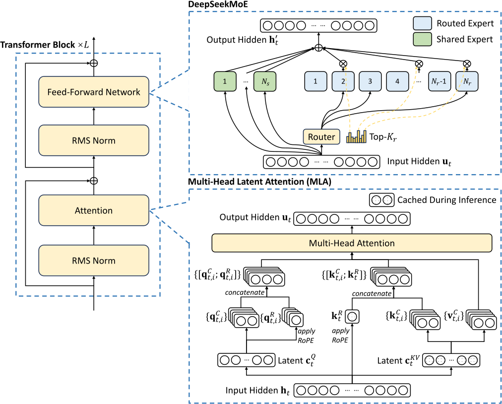

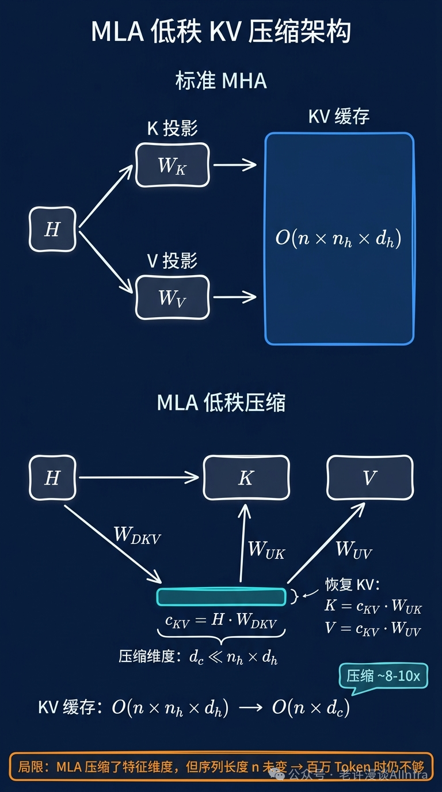

```text
H: [n, d] -> C_KV: [n, d_latent]
```

`d_latent` 小于原本展开后的 KV 表示维度。因此，MLA 主要压缩 hidden/latent 表示维度，降低每个历史 token 需要保存的 KV 表示规模。

从 sequence 维度看，MLA 仍然为每个 token 保留一份 latent 表示：

```text
sequence length: n -> n
representation dim: d_kv -> d_latent
```

因此，MLA 主要降低单个历史位置的表示宽度，并不直接减少历史位置数量。

### DSA：减少访问的历史位置

DSA 的压缩方向不同。它并不主要压缩单个历史位置的表示宽度，而是减少 query 实际访问的历史位置数量。简化表示如下：

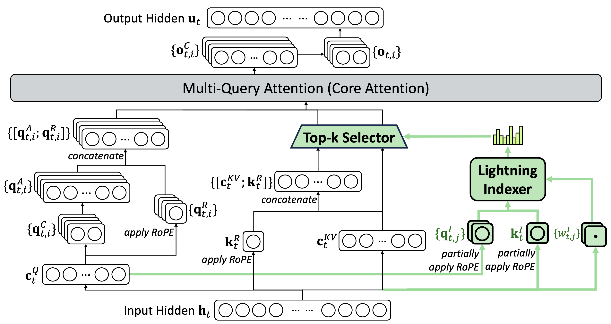

```text
all history positions: [1, 2, ..., n]
selected positions: top-k relevant positions
```

被压缩的是 sequence/block 访问维度。query 通过选择机制确定相关历史 token 或 block，然后仅对这些位置执行 attention。该方法能够降低 attention FLOPs，尤其适用于 decode 阶段。

DSA 的有效性依赖选择机制的质量。如果选择器遗漏关键信息，后续 attention 计算无法访问该信息。因此，sparse attention 的有效性不仅取决于稀疏化比例，还取决于索引器的选择精度、选择粒度以及局部上下文补偿机制。

| 方法 | 主要压缩维度 | 主要缓解的问题 | 仍然留下的问题 |
| --- | --- | --- | --- |
| MHA | 基本不压缩 | 表达直接，结构清楚 | KV cache 大，长上下文 attention 计算重 |
| MQA/GQA | KV head 维度 | 降低 KV cache 中 head 维成本 | sequence 维度仍保持为完整历史长度 |
| MLA | hidden/latent 表示维度 | 降低每个 token 的 KV 表示成本 | 仍要面对大量历史位置 |
| DSA | sequence/block 访问维度 | 减少每次 attention 访问的位置数 | 依赖选择器质量，局部细节需要补偿 |

CSA/HCA 进一步沿 sequence/block 维度压缩 KV entries，将多个 token 的 KV 合并为一个 compressed KV entry。DeepSeek-V4 的 Hybrid Attention 在此基础上组合 KV 压缩、稀疏选择、滑动窗口和层间配置。

## 4. CSA：KV 压缩与稀疏选择

CSA, Compressed Sparse Attention，由 sequence-level KV compression 与 sparse selection 两部分组成。它首先将每 `m` 个 token 的 KV 压缩为一个 compressed KV entry，再通过 learned indexer 从 compressed entries 中选择 top-k，最后与 uncompressed sliding window KV 拼接后执行 attention。

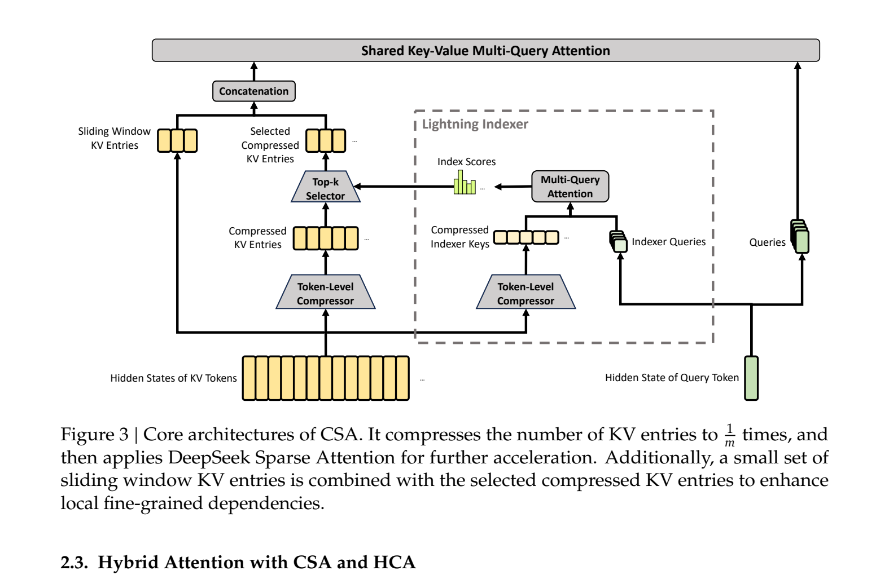

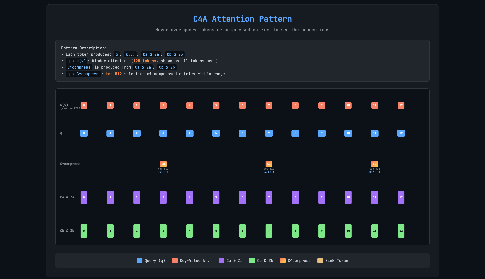

从 tensor 角度看，CSA 的输入可表示为：

```text
H: [n, d]
```

`n` 是当前序列长度，`d` 是 hidden size。CSA 会通过 token-level compressor 生成 compressed KV：

```text
C_comp: [n / m, c]
```

`m` 表示压缩率，`c` 表示压缩后每个 KV entry 的维度。该过程发生在 sequence/block 维度：原始 `n` 个位置被压缩为约 `n/m` 个 compressed entries。

### Learned gated pooling：不是平均池化

CSA 的压缩并非简单平均池化，而是 learned gated pooling。模型首先由 hidden states 生成待压缩的 KV entry 和压缩权重：

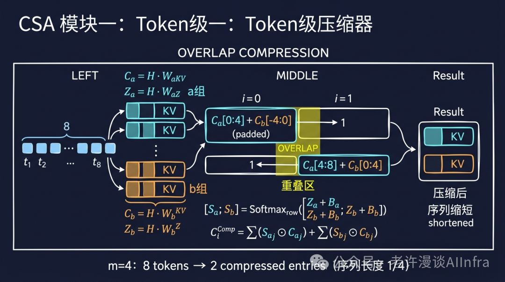

```text
C = H · W_KV
Z = H · W_Z
```

其中 `C` 表示候选 KV 表示，`Z` 表示用于决定压缩权重的 score，`W_KV` 和 `W_Z` 均为可学习参数。该机制允许模型为 block 内不同 token 和不同维度分配不同权重，而不是进行无差别平均。

对于长度为 `m` 的 block，压缩过程可简化表示为：

```text
S = softmax(Z + B)
C_comp = sum_j S_j * C_j
```

`B` 表示可学习的位置 bias，`S_j` 表示第 `j` 个 token 在压缩中的权重。该公式表示，同一 block 内的 token 会以不同权重写入 compressed KV entry，权重由模型学习得到。

CSA 还采用 overlapped compression。技术报告中的 CSA 压缩同时引入当前 block 和前一个 block 的信息；开源 inference 代码中 `compress_ratio == 4` 时 `overlap=True`。该设计用于缓解 block 边界导致的信息割裂，降低相邻 token 因 block 切分而被分离的影响。

### Lightning indexer：在压缩块里选 top-k

获得 `C_comp: [n/m, c]` 后，若每个 query 对全部 compressed entries 执行 dense attention，计算量已经低于原始 `n` 个 token 的 dense attention，但在百万上下文场景下仍可能较高。因此，CSA 进一步引入 indexer。

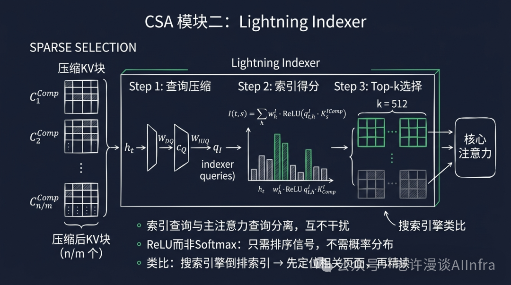

Indexer 为 compressed KV blocks 生成独立的 compressed indexer keys：

```text
K_I_comp: [n / m, c_I]
```

`c_I` 表示 indexer head dimension。对于 query token `t`，indexer 从 query hidden state 生成低秩 indexer query：

```text
h_t -> c_Q_t -> q_I_t
```

随后对每个 compressed block `s` 计算相关性分数：

```text
I_{t,s} = score(q_I_t, K_I_comp_s)
```

`I_{t,s}` 表示 query token `t` 与 compressed block `s` 的相关性。技术报告和代码中还包含多 indexer head、ReLU、head weight 等细节。其功能是在进入 core attention 之前，以较低成本筛选相关 compressed blocks。

随后 CSA 根据 index score 选择 top-k compressed entries：

```text
C_sparse_t = topk(C_comp, I_t, k)
```

该步骤减少 attention 访问数量：query 不再访问全部 `n/m` 个 compressed entries，而是仅访问 top-k entries。

### Sliding window：局部细节与因果边界补偿

CSA 同时保留一段 uncompressed sliding window KV，主要原因包括两点。

第一，compressed block 存在因果边界。query 只能访问其之前已经完成压缩的 blocks，不能访问同一 block 中未来 token 的细粒度信息。第二，语言建模对近邻 token 高度敏感，部分局部依赖不适合过早压缩为粗粒度 entry。

因此，实际 attention 的 KV 来源由两部分组成：

```text
attended KV = concat(sliding_window_KV, selected_compressed_KV)
```

`sliding_window_KV` 保留最近 `n_win` 个原始粒度 token，`selected_compressed_KV` 提供更远历史的压缩检索结果。DeepSeek-V4-Flash 的配置里 `sliding_window` 是 128，开源 inference 代码中 `window_size` 也对应这个概念。

### Shared KV MQA 与 grouped output projection

CSA 的 core attention 使用 shared key-value MQA：compressed KV entry 同时作为 key 和 value，并被多个 query heads 共享。该设计进一步降低 KV head 维度上的成本。

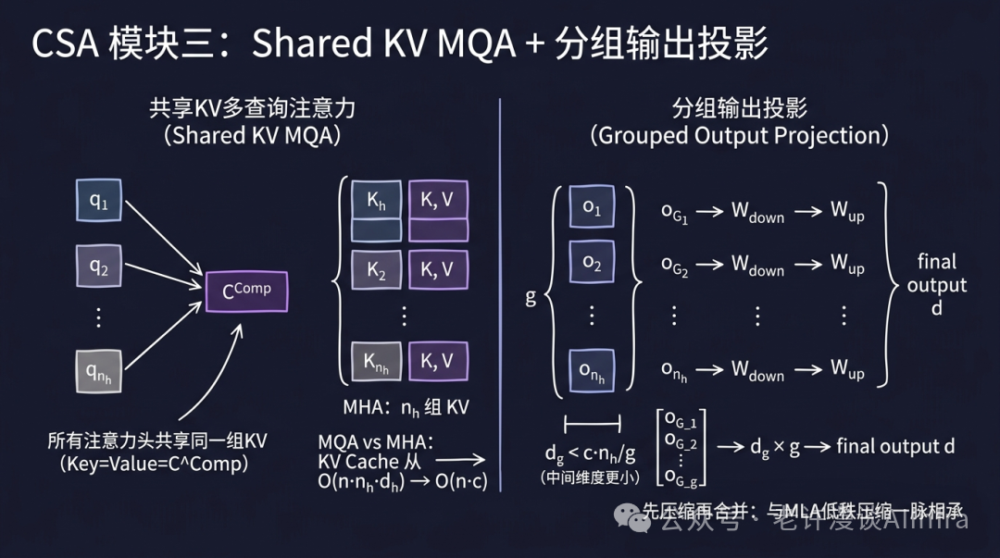

由于 query heads 的输出拼接后维度较大，直接执行完整输出投影会引入较高计算成本。DeepSeek-V4 因此采用 grouped output projection：先将 attention heads 分组，每组投影到较小的中间表示，再合并投回 hidden size。Flash 配置中的 `o_groups=8`、`o_lora_rank=1024` 对应该机制，相关代码位于 `Attention.forward` 的 `wo_a` 和 `wo_b` 路径。

CSA 同时降低 KV cache 长度和长程 attention 访问数量：

```text
KV cache length: n -> n / m
attention visited entries: n / m -> top-k + sliding_window
```

因此，CSA 同时作用于 KV cache 规模和长程 attention 计算量。

## 5. HCA：更高压缩率下的全局注意力

HCA, Heavily Compressed Attention，与 CSA 共享若干基础组件：二者都执行 KV compression，都采用 shared KV MQA 和 grouped output projection，并且都保留 sliding window KV 以补偿局部细节。

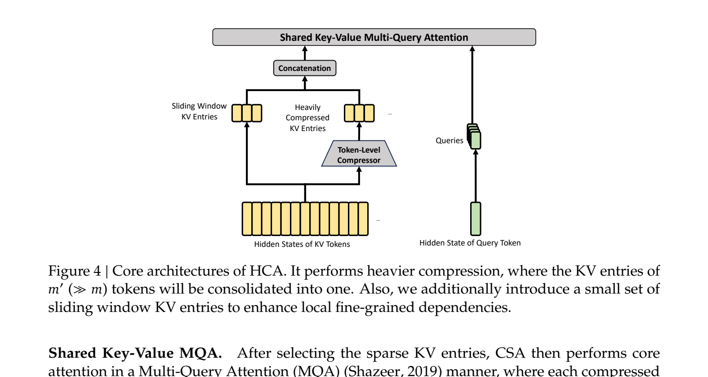

关键差异在于：HCA 使用更高压缩率，但不执行 sparse top-k selection。

从 tensor shape 看，HCA 将原始长度 `n` 压缩为：

```text
C_comp: [n / m', c]
```

其中 `m'` 远大于 CSA 的 `m`。技术报告指出 HCA 使用更大的压缩率 `m' >> m`，且不采用 overlapped compression。在 Flash 与 Pro 配置中，`4` 对应较轻压缩的 CSA 层，`128` 对应重压缩的 HCA 层；二者都以 CSA/HCA 交替作为主要层间组织方式，但边界层配置不同。

HCA 的压缩同样使用 learned weights：

```text
C = H · W_KV
Z = H · W_Z
S = softmax(Z + B)
C_comp_i = sum_j S_j * C_j
```

变量含义与 CSA 相同：`C` 表示候选 KV，`Z` 表示压缩权重的 score，`B` 表示可学习位置 bias。不同之处在于，HCA 的每个 compressed entry 覆盖更长 token span，因此压缩后的 sequence length 更短。

压缩完成后，HCA 不通过 indexer 选择 top-k，而是在 heavily compressed KV entries 上执行 dense attention：

```text
o_t = Attention(q_t, C_comp, C_comp)
```

其中 `C_comp` 同时作为 key 和 value。CSA 更侧重在较细粒度 compressed blocks 中选择相关块；HCA 则将长历史压缩为更粗粒度的全局表示，使 query 能够以较低成本访问全局上下文。

因此，HCA 不应被理解为更稀疏的 CSA。HCA 的长程分支是 dense attention，只是 dense attention 的对象从 `n` 个原始 token 变为 `n/m'` 个 heavily compressed entries。例如，当 1M token 使用 `m'=128` 时，长程 entries 数量约为 8192，显著少于原始 token 数。

需要再次区分 HCA 与 mHC：HCA 是 attention 中的重压缩全局分支；mHC 是 residual connection 相关机制。后续讨论聚焦 HCA 与 CSA 在 Hybrid Attention 中的分工。

## 6. 混合注意力架构：CSA 与 HCA 如何分工

DeepSeek-V4 采用 CSA 与 HCA 的混合配置，而不是单独使用其中一种 attention 形式。该配置体现了二者在长程信息访问上的互补关系。

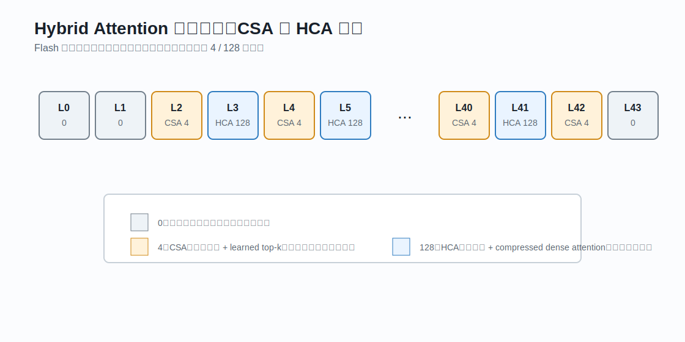

CSA 采用较轻压缩和稀疏选择，保留更细的 long-range block 粒度，适合进行相对精细的长程检索。当 query 只需要历史中的少数相关片段时，CSA 的 indexer 可筛选这些 compressed blocks。

HCA 采用重压缩和 compressed dense attention，不依赖 top-k 选择少数块，而是以较低成本提供粗粒度全局覆盖。

仅使用 CSA 会引入两类成本：其一，indexer 和 top-k sparse attention 本身具有额外计算开销；其二，层层依赖稀疏选择会持续要求模型判断相关历史块。仅使用 HCA 也存在局限，因为过高压缩率会降低长程信息粒度，从而影响细粒度检索能力。

二者混合后形成如下分工：

| 分支 | 典型压缩率 | 长程访问方式 | 主要作用 |
| --- | --- | --- | --- |
| CSA | 较小，例如配置中的 4 | top-k sparse over compressed entries | 较细粒度长程检索 |
| HCA | 较大，例如配置中的 128 | dense over heavily compressed entries | 低成本全局覆盖 |
| Sliding window | 不压缩 | dense over recent tokens | 局部细节和因果边界补偿 |

从复杂度角度看，CSA 的长程 attention 访问数量受 top-k 上限约束，主要成本与被选中的 compressed entries 数量相关；HCA 的成本则来自对 `n/m'` 个 heavily compressed entries 执行 dense attention。对 full-sequence 视角而言，CSA 可近似理解为以 `top-k` 约束长程工作集，HCA 可近似理解为在长度 `n/m'` 的压缩序列上执行 dense attention。二者结合后，一个分支提供较精细的稀疏检索，另一个分支提供粗粒度全局覆盖。

Flash 与 Pro 的 `compress_ratios` 进一步说明了这种设计并不是单一固定模板，而是随模型规格调整的 layer schedule：

| 版本 | `compress_ratios` 数量 | 不压缩层 | CSA 层，ratio=4 | HCA 层，ratio=128 | 边界模式 | `index_topk` |
| --- | ---: | ---: | ---: | ---: | --- | ---: |
| Flash | 44 | 3 | 21 | 20 | `[0, 0, 4, 128, ... , 4, 0]` | 512 |
| Pro | 62 | 1 | 30 | 31 | `[128, 128, 4, 128, ... , 4, 0]` | 1024 |

Flash 的开头两项和最后一项为 `0`，而 Pro 仅最后一项为 `0`，并且前两项已经使用 HCA。这说明“不压缩层位于开头和结尾”只适用于 Flash 配置，不能外推为 DeepSeek-V4 系列的统一规则。更稳定的结论是：`4/128` 的交替体现了层间交替处理细粒度相关信息和粗粒度全局信息的设计思路；具体边界层如何配置，则随模型版本和规模变化。

因此，Hybrid Attention 不是单一模块优化，而是在 sequence compression、sparse selection、sliding window 和 layer schedule 之间进行权衡的系统设计。

## 7. 从论文公式到推理代码：CSA/HCA 的实现对应

技术报告给出机制定义，开源 inference 代码进一步展示了这些机制在推理路径中的具体组织方式。本节按数据流对应 `Compressor`、`Indexer`、`Attention.forward` 和 `sparse_attn` 等关键模块。

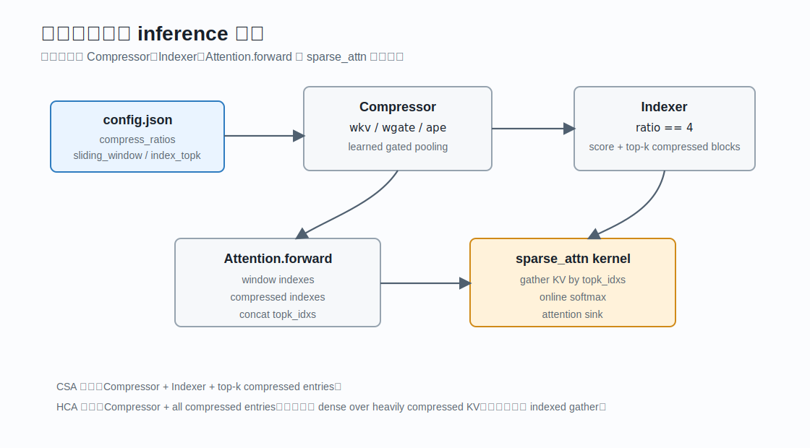

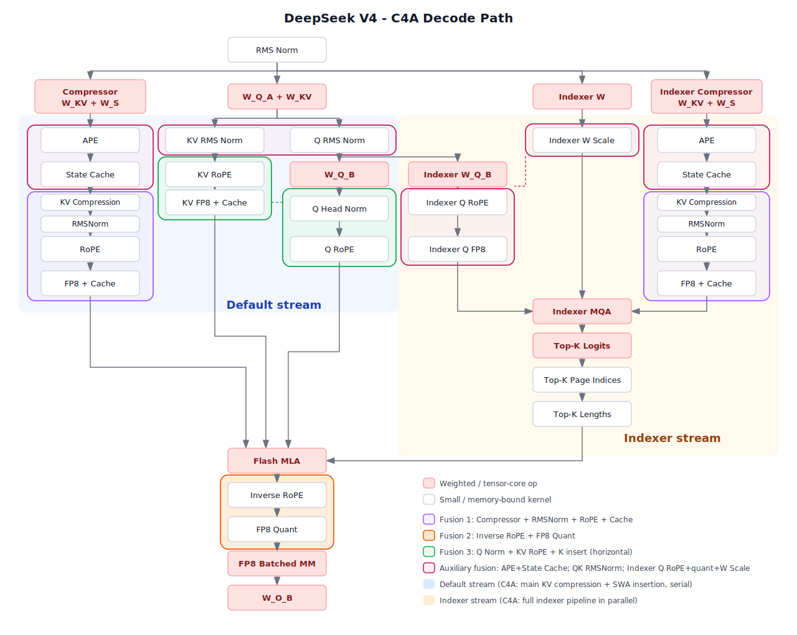

### ModelArgs 与 config.json

Flash 与 Pro 配置显示，两者共享同一套 `inference/model.py` 和 `inference/kernel.py`，CSA/HCA 的实现路径一致；模型规格差异主要由 `config.json` 驱动：

| 配置项 | Flash | Pro | 对应概念 |
| --- | ---: | ---: | --- |
| `num_hidden_layers` | 43 | 61 | Transformer 层数 |
| `hidden_size` | 4096 | 7168 | 主干表示维度 |
| `num_attention_heads` | 64 | 128 | query heads 数量 |
| `num_key_value_heads` | 1 | 1 | shared KV MQA 配置 |
| `max_position_embeddings` | 1048576 | 1048576 | 1M context |
| `sliding_window` | 128 | 128 | sliding window KV 长度 |
| `compress_ratios` | 44 项，0/4/128 | 62 项，0/4/128 | 不压缩层、CSA 层、HCA 层 |
| `head_dim` | 512 | 512 | compressed KV / attention head 维度 |
| `qk_rope_head_dim` | 64 | 64 | 部分 RoPE 维度 |
| `index_topk` | 512 | 1024 | CSA indexer 选择的 top-k |
| `index_head_dim` | 128 | 128 | indexer head 维度 |
| `n_routed_experts` | 256 | 384 | MoE routed experts 数量 |
| `num_experts_per_tok` | 6 | 6 | 每 token 激活专家数 |
| `o_groups` | 8 | 16 | grouped output projection 分组数 |

推理代码中的 `ModelArgs` 字段名与配置文件略有差异。例如，`window_size` 对应配置中的 `sliding_window`，`rope_head_dim` 对应 `qk_rope_head_dim`。

### Compressor：token-level KV 到 block-level KV 的压缩

`inference/model.py` 中的 `Compressor` 对应技术报告中的 token-level compressor。其核心参数包括：

```python
self.ape = nn.Parameter(torch.empty(compress_ratio, coff * self.head_dim))
self.wkv = Linear(self.dim, coff * self.head_dim)
self.wgate = Linear(self.dim, coff * self.head_dim)
self.overlap = compress_ratio == 4
```

`wkv` 生成待压缩 KV，`wgate` 生成压缩权重，`ape` 表示 learnable positional bias。`compress_ratio == 4` 时启用 overlap，对应 CSA 的 overlapped compression；`compress_ratio == 128` 时不启用 overlap，对应 HCA 的重压缩流程。

在 forward 路径中，压缩核心可概括为：

```python
kv = self.wkv(x)
score = self.wgate(x)
score = score + self.ape
kv = (kv * score.softmax(dim=2)).sum(dim=2)
```

该实现对应 learned gated pooling：每个 token 写入 compressed entry 的权重由 `score` 决定，而非平均分配。

decode 阶段需要增量维护尚未形成完整 block 的 token。代码中的 `kv_state` 和 `score_state` 用于缓存未压缩尾部状态，因为单个新 token 到达时不一定立即形成新的 compressed KV entry。

### Indexer：只在 CSA 层出现的稀疏选择器

`Indexer` 只在 `compress_ratio == 4` 时被创建：

```python
if self.compress_ratio == 4:
    self.indexer = Indexer(args, self.compress_ratio)
else:
    self.indexer = None
```

在 Flash 与 Pro 的 inference 代码中，ratio 4 对应 CSA，需要 learned top-k selection；ratio 128 对应 HCA，不创建 indexer。

`Indexer` 内部包含独立的 `Compressor`，用于生成 compressed indexer keys。随后，它从 query 侧生成 indexer query：

```python
q = self.wq_b(qr)
q = q.unflatten(-1, (self.n_local_heads, self.head_dim))
```

随后与 compressed indexer keys 计算 index score：

```python
index_score = torch.einsum("bshd,btd->bsht", q, self.kv_cache[:bsz, :end_pos // ratio])
index_score = (index_score.relu_() * weights.unsqueeze(-1)).sum(dim=2)
topk_idxs = index_score.topk(min(self.index_topk, end_pos // ratio), dim=-1)[1]
```

该过程对应技术报告中的 lightning indexer：先为 compressed blocks 计算相关性分数，再返回 `topk_idxs`，供后续 sparse attention kernel 执行 KV gather。

代码还对 indexer 的 Q/K 路径执行 FP4 simulation：

```python
fp4_act_quant(q, fp4_block_size, True)
```

该细节对应技术报告中 indexer 使用低精度计算以降低长上下文成本的设计。

### Attention.forward：window KV 与 compressed KV 的汇合

`Attention.forward` 是 CSA/HCA 数据流的汇合位置。该函数首先生成 query 和当前 sliding window KV：

```python
q = self.wq_b(q).unflatten(-1, (self.n_local_heads, self.head_dim))
kv = self.wkv(x)
topk_idxs = get_window_topk_idxs(win, bsz, seqlen, start_pos)
```

`get_window_topk_idxs` 生成最近窗口内可访问的位置。若当前层包含 compression 分支，则继续生成 compressed indexes：

```python
if self.indexer is not None:
    compress_topk_idxs = self.indexer(x, qr, start_pos, offset)
else:
    compress_topk_idxs = get_compress_topk_idxs(ratio, bsz, seqlen, start_pos, offset)
topk_idxs = torch.cat([topk_idxs, compress_topk_idxs], dim=-1)
```

该分支体现 CSA 与 HCA 的实现差异：

- CSA 层：`self.indexer is not None`，使用 learned indexer 生成 top-k compressed indexes。
- HCA 层：不存在 indexer，`get_compress_topk_idxs` 返回所有已完成的 compressed entries，等价于在 heavily compressed entries 上执行 dense attention。

最终，attention kernel 接收统一格式的 `topk_idxs`：

```python
o = sparse_attn(q, kv_or_cache, self.attn_sink, topk_idxs, self.softmax_scale)
```

因此，sliding window、CSA top-k 和 HCA 的全部 compressed entries 都被组织为基于 index 的 KV gather 形式，并进入同一个 sparse attention kernel。HCA 在概念上是 dense over compressed entries；在实现上，只要 index 列表包含全部 compressed entries，就可复用 indexed gather 路径实现等价计算。

### sparse_attn：基于 index 的 KV gather 与 online softmax

`inference/kernel.py` 的 `sparse_attn` 对应执行 attention 的 TileLang kernel。其输入包括：

```python
q: [b, m, h, d]
kv: [b, n, d]
topk_idxs: [b, m, topk]
```

kernel 根据 `topk_idxs` 将 KV gather 到 tile 中，并对每个 query 执行点积、softmax 和加权求和。实现使用 running max / running sum 形式的 online softmax，避免一次性 materialize 大量 attention score。同时，kernel 引入 `attn_sink`，对应技术报告中的 attention sink 设计。

低精度策略也体现在该路径中：非 RoPE 维度可执行 FP8 simulation，RoPE 的最后 64 维保留较高精度，以维持位置信息稳定。这与技术报告中 RoPE 维度使用 BF16、其余维度使用 FP8 的描述一致。

### KV Cache 管理与分层存储

Hybrid Attention 也改变了推理侧 KV cache 的组织方式。传统 PagedAttention 假设各层 KV cache 具有较一致的 block 管理策略；而 DeepSeek-V4 中不同层可能使用 CSA、HCA 或纯 sliding window，不同分支的 cache 生命周期、压缩率和访问模式并不相同。

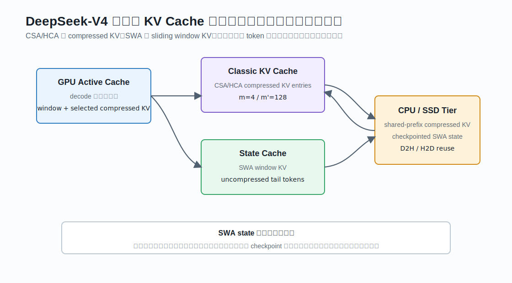

一种更合适的理解方式是将推理状态拆成两类：

| 缓存类型 | 保存内容 | 作用 |
| --- | --- | --- |
| Classic KV Cache | CSA/HCA 生成的 compressed KV entries | 保存可复用的长程压缩历史 |
| State Cache | sliding window KV 与尚未形成完整压缩块的尾部 token 状态 | 支持局部窗口和增量压缩 |

在 shared-prefix 复用场景中，compressed KV entries 的体积较小，可以作为更适合跨请求复用和分层存储的对象。SWA sliding window KV 体积更大、状态更短期，因此可以采用不同恢复策略：全量缓存最近窗口、周期性保存 checkpoint 并重算尾部，或完全不缓存并在需要时重算。该设计将长程压缩历史和局部状态分开管理，有助于降低百万上下文推理对 GPU 显存容量的依赖。

## 8. 效果评估：效率收益与长上下文表现

CSA/HCA 的主要作用在于降低百万上下文推理中的 attention 计算和 KV cache 成本。

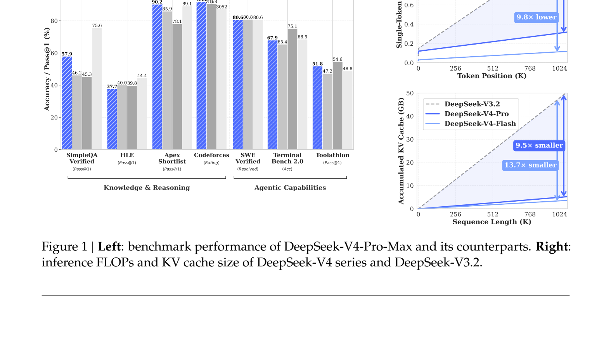


DeepSeek-V4 技术报告给出了 1M context 下相对 DeepSeek-V3.2 的效率对比：

| 模型 | 1M context single-token inference FLOPs | 1M context KV cache |
| --- | ---: | ---: |
| DeepSeek-V4-Pro | 约 27% | 约 10% |
| DeepSeek-V4-Flash | 约 10% | 约 7% |

报告中的 FLOPs 使用 equivalent FP8 FLOPs 口径，比较对象是长上下文场景下的 single-token inference。上述收益来自一组组合设计，包括 hybrid CSA/HCA、低精度计算与存储、较小 top-k、混合 KV 存储格式等，不应归因于 CSA 或 HCA 的单一模块贡献。

长上下文能力方面，技术报告和 README 列出了 MRCR 1M、CorpusQA 1M、LongBench-V2 等结果。这些结果的意义在于说明模型不仅支持 1M context，还需要在该长度下保持可用能力，并将推理成本控制在更接近实际部署需求的范围内。

由此可归纳出以下设计启示：

- 仅压缩表示维度不足以解决长上下文成本问题，sequence 维度也需要被压缩或稀疏化。
- 稀疏选择需要与局部窗口和全局粗粒度覆盖配合，才能兼顾细粒度依赖和全局信息。
- 长上下文 attention 是系统设计问题，需要同时考虑压缩率、选择器、KV cache 管理、低精度格式和层间 schedule。

DeepSeek-V4 的 Hybrid Attention 可概括为三类机制的协同：CSA 负责较细粒度长程选择，HCA 负责低成本全局覆盖，sliding window 负责局部细节补偿。三者共同将百万上下文从“支持长输入长度”推进到“降低长上下文实际推理成本”。

## 参考资料

- DeepSeek-V4 Technical Report: https://huggingface.co/deepseek-ai/DeepSeek-V4-Pro/blob/main/DeepSeek_V4.pdf
- DeepSeek-V4-Pro Hugging Face model card and benchmark tables: https://huggingface.co/deepseek-ai/DeepSeek-V4-Pro
- DeepSeek-V4 figures on Hugging Face Blog: https://huggingface.co/blog/deepseekv4
- DeepSeek-V3 Hugging Face Transformers documentation: https://huggingface.co/docs/transformers/model_doc/deepseek_v3
- DeepSeek API Models & Pricing: https://api-docs.deepseek.com/quick_start/pricing
- OpenAI API Pricing: https://openai.com/zh-Hans-CN/api/pricing/
- Anthropic Claude API Pricing: https://platform.claude.com/docs/en/about-claude/pricing
- Google Gemini API Pricing: https://ai.google.dev/gemini-api/docs/pricing
- vLLM DeepSeek V4 engineering blog: https://vllm.ai/blog/2026-04-24-deepseek-v4
- vLLM FP8 KV Cache and Attention Quantization: https://vllm.ai/blog/2026-04-22-fp8-kvcache
- NVIDIA, Optimizing Inference for Long Context and Large Batch Sizes with NVFP4 KV Cache: https://developer.nvidia.com/blog/optimizing-inference-for-long-context-and-large-batch-sizes-with-nvfp4-kv-cache/
- Pratham Patel, DeepSeek-V4 Hybrid Attention from Scratch: https://prathamp.com/blog/deepseek-v4-csa-and-hca/
- 老许漫谈 AIInfra，《DeepSeek V4 万字拆解：逼近闭源天花板，价格却只要 1/6》
- 补充图：标准注意力机制、MLA 低秩压缩、CSA token compressor、CSA lightning indexer、CSA shared KV MQA 与 grouped output projection
- Attention Is All You Need: https://arxiv.org/abs/1706.03762
- Wikimedia MHA diagram, Cosmia Nebula, CC BY-SA 4.0: https://commons.wikimedia.org/wiki/File:Transformer_architecture_-_Multiheaded_Attention_module.png
- DeepSeek-V2 MLA/MoE diagram, DeepSeek, MIT License: https://commons.wikimedia.org/wiki/File:DeepSeek_MoE_and_MLA_(DeepSeek-V2).svg
- NVIDIA TensorRT-LLM DSA 架构说明调研: https://nvidia.github.io/TensorRT-LLM/blogs/tech_blog/blog17_Sparse_Attention_in_TensorRT-LLM.html
- DeepSeek-V4-Flash / Pro 开源配置与推理实现：`config.json`, `inference/model.py`, `inference/kernel.py`
